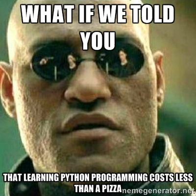

Lesson 1 - Welcome!
===================



You're about to embark on a journey into the world of computer programming! We will learn introductory computer science concepts and make some cool stuff along the way using Python. Python is an amazing language to learn and create with; take a look at some of these success stories:

https://www.python.org/about/success/

In this lesson we'll learn how to create, save, change, and run a Python program with Sublime Text. Let's get started! :]

### Creating a Python Program
-----------------------------

To create a Python program, it is helpful to have a good text editor. We will use Sublime Text, but there are many others to choose from as well.

First open Sublime Text. If you don't have Sublime Text installed, you can find it here:
http://www.sublimetext.com/

It is tradition to create a Hello World Program when you are learning a new programming language. Now that we have our text editor ready to go, let's create and run a Hello World Program in Python.

Type the following code:

```
print("Hello world!")
```

Mmmmm, that's it!? Yup! :]

Save your file (command + s or ctrl + s) on your computer at python-training/Lesson1 (inside the Lesson1 folder). Now, in Sublime Text go to Tools > Build (command + b or ctrl + b). This should run your program. At the bottom of Sublime Text, you should see something like this:

```
Hello world!
```

Congratulations, you created and ran a Hello World Program in Python!


### Something More Exciting - Working with Python Lists and Random Numbers
--------------------------------------------------------------------------

Now let's do something a bit more exciting. We're going to create a list of Skittles flavors and `print` a random flavor.
#### Create a list of Skittles flavors:

```
flavors = ["Banana", "Kiwi", "Mango", "Grape", "Lemon", "Orange", "Strawberry"]
```

We create a list with brackets `[]` and add `string`s to the list that represent each flavor. We separate each element of the list with `,`. We then assign this list to the variable name `flavors`.

Before we get fancy with printing a random flavor, let's print the first flavor. Lists in Python use zero-based numbering. This means that the first element is found with

```
flavors[0]
```

A way to think about lists is that the first element is the 'zeroth' element. We can see the elements of the `flavors` list as so:

```
flavors[0] is "Banana"
flavors[1] is "Kiwi"
flavors[2] is "Mango"
...
flavors[6] is "Strawberry"

or

lengthOfFlavors = 7 (7 items in our list)
flavors[lengthOfFlavors - 1] = flavors[6] is "Strawberry"
```

Therefore, to print the first element of the list, we write
```
print(flavors[0])
```

#### Generating a random index (position)

To print a random flavor, we need to generate a number between 0 and 6 randomly. Here's how we'll do it:

```
from random import randint
randomIndex = randint(0,6)
print(flavors[randomIndex])
```

In the first line, we get `randint` from the module `random` to allow us to generate random numbers. Then we use `randint(0,6)` to generate a random number between 0 and 6 inclusive and assign this number to `randomIndex`. Finally, we print the flavor at the position `randomIndex` within the list `flavors`. If you run the program many times, you will see a random flavor printed to the screen each time! Kindof cool, heh? :]

"Skittles!!"


### User Input
-----------------------------

Sublime Text doesn't work well when we want our program to accept user input, so we'll use the UNIX command line for this instead. If you're using OS X, open Terminal.

HINT: It may help to use the Spotlight Search (found on the top tool bar). Search 'Terminal' and open it.

In Terminal type:

```
python
```

This runs whats called a *Python Interpreter*. Here we can write and run Python; it's very nice for experimenting.

You should see something like this:
```
Python 2.7.6
[GCC 4.2.1 Compatible Apple LLVM 6.0 (clang-600.0.39)] on darwin
Type "help", "copyright", "credits" or "license" for more information.
>>>
```

Now type
```
name = raw_input("What's your name?")
```

Hit enter to run. Type in your name.

Type the following code:
```
print("Hello, " + name + "!")
```

Amazing! We use `raw_input()` to accept user input from the command line and save the result to the variable `name`. Then we tell Python to concatenate (using `+`) the strings `"Hello, "`, the value of `name`, and `"!"`. Finally, we print the result. 

Nice job! Now it's your turn to write some code. Open the file *lesson1.py* in your favorite text editor and view *practice_instructions.md* on GitHub (found in python-training/Lesson1) for instructions.

##### References:
----------

https://www.python.org/about/success/

https://en.wikipedia.org/wiki/List_of_Skittles_products
