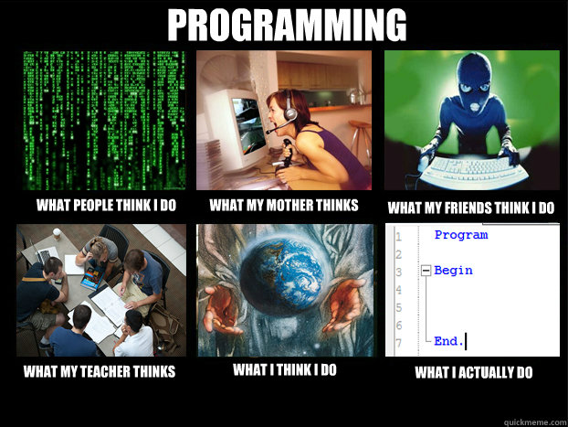

Welcome!
=======

Welcome to the python-training repository on GitHub! Here I will post new articles and lessons to teach Python and introductory programming principles. Programming can be a fun and exciting subject to learn, and my goal here is to make learning computer science an interesting endeavor. If you have comments or concerns, feel free to post them in the Issues section of this repository on GitHub.

Here are my thoughts regarding the content that will be posted here:
1. I want to make learning computer science fun and interesting by providing engaging projects and lessons.
2. My goal is to teach introductory computer science concepts that will help you learn from other sources.
3. I assume you're somewhat familiar with Python already. You don't have to be an expert; going through the exercises up to the "EXAM STATISTICS" section on codecademy.com should be enough.

Let's get started! Go to the folder Lesson1 and read lesson.md. See you there, and happy programming!
